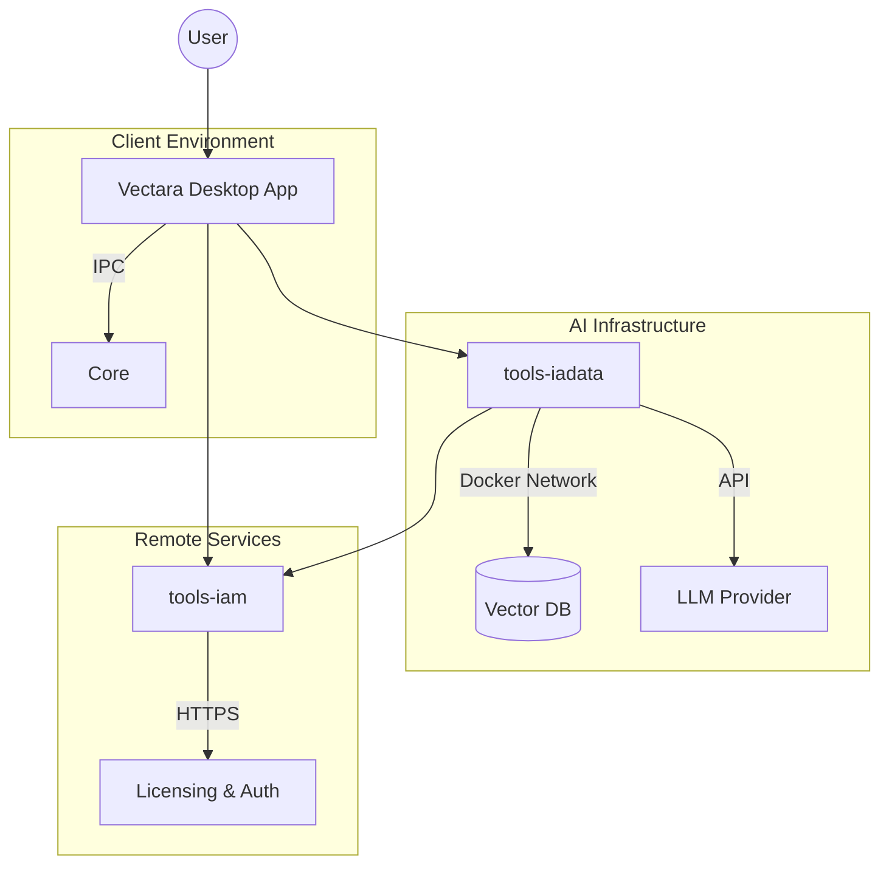

# System Architecture

## High-Level Diagram

## Components

### 1. Vectara (Desktop)
- **Role**: Main user interface
- **Tech**: Tauri 2.x, Rust, React/Vue

### 2. tools-iadata (AI Backend)
- **Role**: Specialized AI tasks, chatbot orchestration
- **Tech**: Docker, Python, FastAPI, Qdrant
- **Deployment**: containerized stack

### 3. tools-iam (External Service)
- **Role**: Independent Licensing Provider
- **Tech**: [External Project]
- **Integration**: Accessed via secure API (HTTP/REST)

## Data Flow
1. **Auth**: Apps authenticate against `tools-iam`.
2. **Chat**: `vectara` sends prompts to `tools-iadata`.
3. **Storage**: vectors stored in `tools-iadata` volume.

