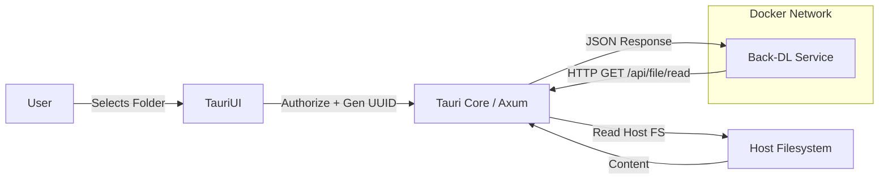

# Feature: api-bridge
**ID**: 0510
**Created**: 2026-01-23
**Last Updated**: 2026-01-23
**Status**: IMPLEMENTED

## 1. Objective
Implement an **API Bridge Pattern** that allows Dockerized containers (specifically `back-dl` and `llm-dl`) to access restricted paths on the Host Filesystem via the Tauri application. This bypasses the limitation of static Docker volume mounts, allowing users to dynamically authorize new folders (e.g., "My Documents") for RAG ingestion without restarting the stack.

## 2. Analysis & Requirements

### 2.1 The Problem
- Docker containers are isolated. Accessing host files requires volume mounts defined *at startup* in `docker-compose.yml`.
- Users want to point the RAG system to *any* folder on their computer at runtime.
- Restarting the Docker stack to add volumes is slow and UX-hostile.

### 2.2 The Solution: API Bridge
- **Tauri Side**: Runs a lightweight HTTP server (Axum) on `localhost:3737`.
- **Docker Side**: `back-dl` connects to `host.docker.internal:3737` to request file content.
- **Security**:
    - **No Open Access**: The server only serves paths *explicitly authorized* by the user via native dialogs.
    - **UUID Mapping**: We generate a random UUID for each authorized folder. The Docker container requests files by UUID (`path_id`) + `relative_path`, never absolute host paths.
    - **Traversal Protection**: The server enforces that resolved paths must begin with the authorized base path.

## 3. Architecture

## 4. Implementation Details

### 4.1 Backend (Rust/Tauri)
- **Framework**: `axum` (0.7)
- **Port**: `3737` (Fixed internal port)
- **State Management**: `Arc<RwLock<HashMap<String, PathBuf>>>` to store valid `uuid -> path` mappings.
- **Endpoints**:
    - `POST /api/file/list`: List files in a directory (recursive or flat).
    - `POST /api/file/read`: Read file content.
    - `GET /api/paths`: List authorized path IDs (internal debugging/sync).

### 4.2 Frontend (React)
- **Hook**: `useFileSystem`
- **Commands**: 
    - `authorize_folder()`: Opens native picker, returns UUID.
    - `revoke_folder(uuid)`: Removes access.
    - `get_authorized_folders()`: Returns current list.

### 4.3 Docker Integration
- **`back-dl` (FastAPI)**:
    - Needs a client module `FileBridgeClient`.
    - Base URL: `http://host.docker.internal:3737`.
    - **Zero Conf**: Standard Docker Desktop / Linux Docker setup supports `host.docker.internal`. (On Linux, may need `extra_hosts` in compose).

## 5. Security & Risks
- **Risk**: Malicious container accessing system files.
    - **Mitigation**: Traversal protection key. The server recursively checks `canonicalize(full_path).starts_with(base_path)`.
- **Risk**: Port 3737 exposed to LAN.
    - **Mitigation**: Bind strictly to `127.0.0.1`. Docker containers reach it via gateway mapping, not public IP. *Check this: Docker internal gateway IP might differ.*

## 6. Implementation Plan

### Phase 1: Rust Backend
- [ ] Add dependencies: `axum`, `tokio`, `tower-http`, `uuid`, `serde`, `serde_json`.
- [ ] Implement `HttpServer` module.
- [ ] Implement `PathMap` state.
- [ ] Integrate into `main.rs` setup.

### Phase 2: Frontend Hooks
- [ ] Create `useFileSystem` hook.
- [ ] Create `FolderManager` component test UI.

### Phase 3: Docker Connectivity
- [ ] Verify `curl http://host.docker.internal:3737/api/paths` works from inside `back-dl`.
