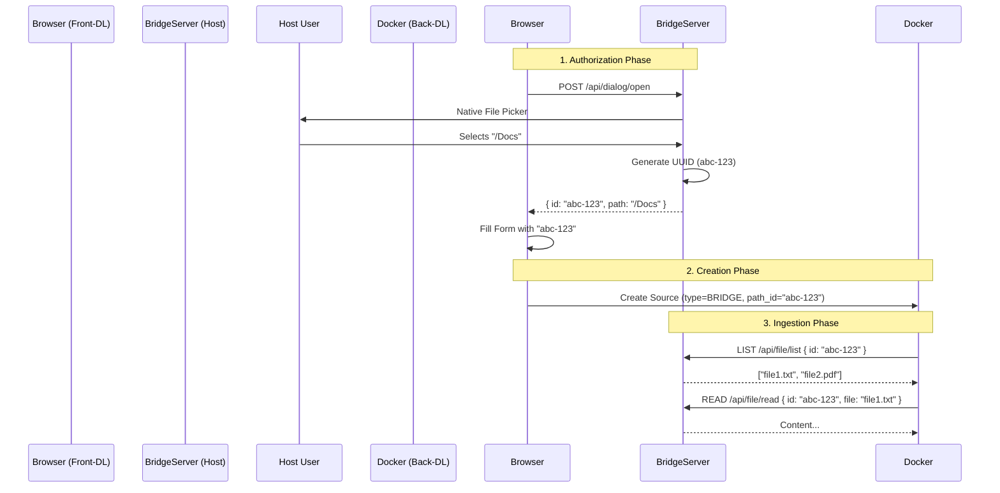

# Feature: api-bridge-client
**ID**: 0511
**Created**: 2026-01-23
**Last Updated**: 2026-01-23
**Status**: IMPLEMENTED

## 1. Objective
Implement the client-side integration of the API Bridge in the `tools-iadata` application (`back-dl` and `front-dl`).
Ensure a seamless "Choose Folder" experience by triggering the Host Native Dialog via a new HTTP endpoint on the Bridge Server.

## 2. Requirements

### 2.1 Backend Client (`back-dl`)
- [ ] **FileBridgeClient**: Python class to interact with `http://host.docker.internal:3737`.
    - Methods: `list_files(path_id)`, `read_file(path_id, rel_path)`.
- [ ] **Ingestion Integration**: Update `agents.py` (or source router) to recursively ingest files when Source Type is "LOCAL_BRIDGE".

### 2.2 Frontend Integration (`front-dl`)
- [ ] **UI Update**: In `DataSourceForm.tsx`:
    - Add "Choose Directory" button for Local Sources.
    - Keep legacy "Manual Path" input as fallback/advanced option.
- [ ] **Bridge Interaction**:
    - Click "Choose Directory" -> call `POST http://localhost:3737/api/dialog/open`.
    - Receive `{ path_id: "...", path: "..." }`.
    - Auto-fill the form.

### 2.3 Bridge Server Updates (`vectara`)
To support the seamless frontend flow without complex Tauri IPC configuration:
- [ ] **State Update**: Store `AppHandle` in `AppState`.
- [ ] **New Endpoint**: `POST /api/dialog/open`.
    - Triggers `app_handle.dialog().file().pick_folder()` on the Host Main Thread.
    - Returns the UUID and Path to the caller (browser).

## 3. Architecture

## 4. Implementation Plan

### Phase 1: Bridge Server Updates (Rust)
- [x] Modify `AppState` to include `AppHandle`.
- [x] Implement `open_dialog_handler` in `handlers.rs`.
- [x] Register route in `mod.rs`.

### Phase 2: Frontend (React)
- [x] Update `DataSourceForm.tsx` to use `http://localhost:3737`.
- [x] Add "Choose Directory" button.

### Phase 3: Backend (Python - back-dl / llm-dl)
- [x] Locate ingestion logic (Implemented mock ingestion)
- [x] Create `FileBridgeClient`.
- [x] Integrate into ingestion flow (`POST /ingest`).

## 5. Compatibility
- **Linux/Windows**: The Bridge Server abstracts the file system differences.
    - Windows Paths (`C:\...`) handled by Rust.
    - Docker sees only relative paths + content.
    - Browser sees `path_id`.
