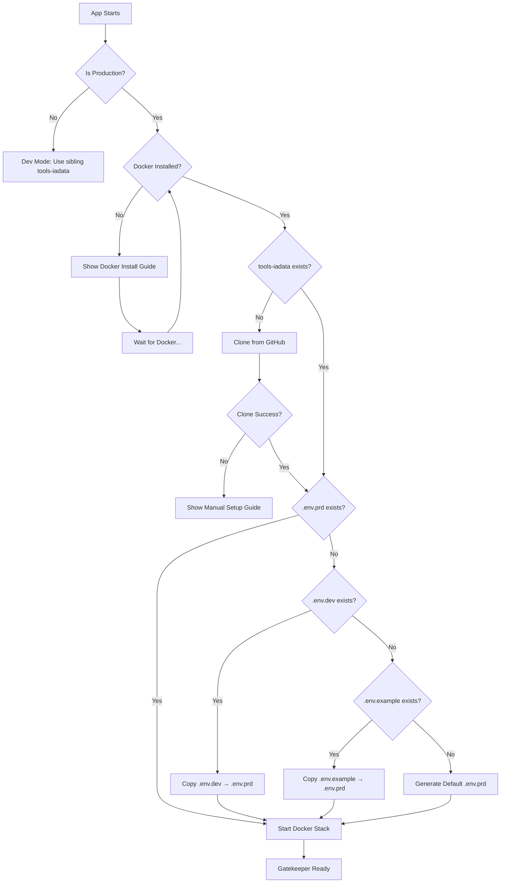

# Feature: Standalone EXE Deployment Strategy
> **ID:** PENDING-0600-exe-deployment-260126  
> **Date:** 2026-01-26  
> **Status:** Planning  

---

## 1. Problem Statement

The Vectara application consists of two components:
```
root/
├── vectara/          # Tauri desktop app (compiled to .exe)
└── tools-iadata/     # Docker stack (backend services)
```

**Challenge:** When distributing only the `.exe`, users need the `tools-iadata` Docker stack to be available and configured. The system must:
1. Work identically in **dev** and **production** environments
2. Auto-clone `tools-iadata` from GitHub if missing (production only)
3. Guide users through Docker Desktop installation
4. Bootstrap environment files from cascade fallback
5. Detect dev vs production context automatically

---

## 2. Professional Architecture Analysis

### 2.1 Runtime Context Detection

**Standard Practice:** Use Tauri's build-time detection, NOT filesystem heuristics.

```rust
// Compile-time detection (reliable)
const IS_RELEASE: bool = !cfg!(debug_assertions);

// Alternative: Check if running from installed location
fn is_production() -> bool {
    if cfg!(debug_assertions) {
        return false; // Dev build
    }
    // Production: Running from Program Files or AppData
    let exe_path = std::env::current_exe().ok();
    exe_path.map(|p| {
        let path_str = p.to_string_lossy().to_lowercase();
        path_str.contains("program files") || 
        path_str.contains("appdata") ||
        !path_str.contains("target")  // Not in cargo target dir
    }).unwrap_or(true)
}
```

### 2.2 Stack Location Strategy

| Context | tools-iadata Location | Rationale |
|---------|----------------------|-----------|
| **Dev** | `../tools-iadata` (sibling) | Standard monorepo layout |
| **Production** | `%APPDATA%/Vectara/tools-iadata` | Isolated, user-writable |

```rust
fn get_tools_iadata_path(is_production: bool) -> PathBuf {
    if is_production {
        // Production: Use AppData
        dirs::data_dir()
            .unwrap_or_else(|| PathBuf::from("."))
            .join("Vectara")
            .join("tools-iadata")
    } else {
        // Dev: Sibling directory
        PathBuf::from("../tools-iadata").canonicalize()
            .unwrap_or_else(|_| PathBuf::from("../tools-iadata"))
    }
}
```

---

## 3. Bootstrap Sequence (Production)



---

## 4. Implementation Components

### 4.1 Docker Strategy: Guided Installation

> [!IMPORTANT]
> **Docker Cannot Be Bundled**
> Unlike git (solved with `git2`), Docker is an OS-level daemon. The professional approach is **guided installation**.

#### Approach Comparison

| Approach | Recommendation | Notes |
|----------|----------------|-------|
| **Require Docker Desktop** | ✅ **Recommended** | Standard, well-supported, free for personal use |
| Bundle Docker installer | ❌ Not advised | ~500MB, licensing restrictions |
| WSL2 + Docker Engine | ❌ Too complex | Windows-only, manual setup |
| Podman | ⚠️ Future option | Rootless, but less adoption |

#### Docker Detection Code

```rust
// docker.rs
use std::process::Command;

#[derive(Debug, Clone, serde::Serialize)]
pub enum DockerStatus {
    NotInstalled,
    InstalledNotRunning,
    Running,
}

pub fn check_docker_status() -> DockerStatus {
    // Check if docker CLI exists
    let version_check = Command::new("docker")
        .arg("--version")
        .output();
    
    match version_check {
        Ok(output) if output.status.success() => {
            // Docker installed, check if daemon is running
            let info_check = Command::new("docker")
                .arg("info")
                .output();
            
            match info_check {
                Ok(o) if o.status.success() => DockerStatus::Running,
                _ => DockerStatus::InstalledNotRunning,
            }
        }
        _ => DockerStatus::NotInstalled,
    }
}

/// Get platform-specific Docker Desktop download URL
pub fn get_docker_download_url() -> &'static str {
    #[cfg(target_os = "windows")]
    { "https://desktop.docker.com/win/main/amd64/Docker%20Desktop%20Installer.exe" }
    
    #[cfg(target_os = "macos")]
    { "https://desktop.docker.com/mac/main/amd64/Docker.dmg" }
    
    #[cfg(target_os = "linux")]
    { "https://docs.docker.com/desktop/install/linux-install/" }
}

/// Open Docker download page in default browser
pub fn open_docker_download() -> Result<(), String> {
    let url = get_docker_download_url();
    open::that(url).map_err(|e| e.to_string())
}
```

#### Installation Wizard UI (Gatekeeper.tsx)

```tsx
// DockerSetupWizard component
const DockerSetupWizard: React.FC<{ onComplete: () => void }> = ({ onComplete }) => {
  const [status, setStatus] = useState<'checking' | 'not_installed' | 'not_running' | 'ready'>('checking');
  
  const checkDocker = async () => {
    setStatus('checking');
    const result = await invoke<string>('check_docker_status');
    
    if (result === 'Running') {
      setStatus('ready');
      onComplete();
    } else if (result === 'InstalledNotRunning') {
      setStatus('not_running');
    } else {
      setStatus('not_installed');
    }
  };
  
  useEffect(() => { checkDocker(); }, []);
  
  if (status === 'not_installed') {
    return (
      <div className="setup-panel">
        <h2>Docker Required</h2>
        <p>Vectara requires Docker Desktop to run AI services locally.</p>
        
        <div className="install-steps">
          <ol>
            <li>Click "Download Docker Desktop" below</li>
            <li>Run the installer (admin rights required)</li>
            <li>Restart your computer when prompted</li>
            <li>Launch Docker Desktop from Start Menu</li>
            <li>Return here and click "Check Again"</li>
          </ol>
        </div>
        
        <div className="actions">
          <button onClick={() => invoke('open_docker_download')}>
            📥 Download Docker Desktop
          </button>
          <button onClick={checkDocker}>
            🔄 Check Again
          </button>
        </div>
        
        <p className="note">Docker Desktop is free for personal use and small businesses.</p>
      </div>
    );
  }
  
  if (status === 'not_running') {
    return (
      <div className="setup-panel">
        <h2>Start Docker Desktop</h2>
        <p>Docker is installed but not running.</p>
        
        <ol>
          <li>Open Docker Desktop from Start Menu / Applications</li>
          <li>Wait for the Docker engine to start (whale icon in taskbar)</li>
          <li>Click "Check Again" below</li>
        </ol>
        
        <button onClick={checkDocker}>🔄 Check Again</button>
      </div>
    );
  }
  
  return <div>Checking Docker status...</div>;
};
```

### 4.2 GitHub Clone & Update with `git2` (No System Git Required)

> [!TIP]
> **Using `git2` crate** - Bundles libgit2 statically. Users don't need git installed.

**Add dependency:**
```toml
# Cargo.toml
[dependencies]
git2 = "0.18"
```

```rust
// bootstrap.rs
use git2::{Repository, FetchOptions, build::CheckoutBuilder};
use std::path::Path;

const TOOLS_IADATA_REPO: &str = "https://github.com/PiloTracer/vectara.git";

/// Clone tools-iadata from GitHub (first run)
pub fn clone_tools_iadata(target_dir: &Path) -> Result<(), String> {
    // Ensure parent directory exists
    if let Some(parent) = target_dir.parent() {
        std::fs::create_dir_all(parent).map_err(|e| e.to_string())?;
    }
    
    Repository::clone(TOOLS_IADATA_REPO, target_dir)
        .map_err(|e| format!("Clone failed: {}", e))?;
    
    Ok(())
}

/// Pull latest updates (subsequent runs)
pub fn update_tools_iadata(repo_path: &Path) -> Result<(), String> {
    let repo = Repository::open(repo_path)
        .map_err(|e| format!("Failed to open repo: {}", e))?;
    
    // Find origin remote
    let mut remote = repo.find_remote("origin")
        .map_err(|e| format!("No origin remote: {}", e))?;
    
    // Fetch latest
    let mut fetch_opts = FetchOptions::new();
    remote.fetch(&["main"], Some(&mut fetch_opts), None)
        .map_err(|e| format!("Fetch failed: {}", e))?;
    
    // Get FETCH_HEAD
    let fetch_head = repo.find_reference("FETCH_HEAD")
        .map_err(|e| format!("No FETCH_HEAD: {}", e))?;
    let fetch_commit = repo.reference_to_annotated_commit(&fetch_head)
        .map_err(|e| format!("Invalid commit: {}", e))?;
    
    // Check if fast-forward is possible
    let (analysis, _) = repo.merge_analysis(&[&fetch_commit])
        .map_err(|e| format!("Merge analysis failed: {}", e))?;
    
    if analysis.is_fast_forward() {
        // Fast-forward merge
        let mut reference = repo.find_reference("refs/heads/main")
            .map_err(|e| format!("No main branch: {}", e))?;
        reference.set_target(fetch_commit.id(), "Fast-forward pull")
            .map_err(|e| format!("Set target failed: {}", e))?;
        
        // Checkout the updated HEAD
        repo.checkout_head(Some(CheckoutBuilder::default().force()))
            .map_err(|e| format!("Checkout failed: {}", e))?;
    } else if analysis.is_up_to_date() {
        // Already up to date, nothing to do
    } else {
        return Err("Cannot fast-forward, manual intervention needed".to_string());
    }
    
    Ok(())
}

/// Check if tools-iadata needs update (compare local vs remote)
pub fn check_for_updates(repo_path: &Path) -> Result<bool, String> {
    let repo = Repository::open(repo_path)
        .map_err(|e| format!("Failed to open repo: {}", e))?;
    
    let mut remote = repo.find_remote("origin")
        .map_err(|e| format!("No origin remote: {}", e))?;
    
    // Fetch without merging
    remote.fetch(&["main"], None, None)
        .map_err(|e| format!("Fetch failed: {}", e))?;
    
    // Compare HEAD with FETCH_HEAD
    let head = repo.head().ok().and_then(|h| h.target());
    let fetch_head = repo.find_reference("FETCH_HEAD").ok()
        .and_then(|r| r.target());
    
    Ok(head != fetch_head)
}
```

### 4.3 Environment File Cascade

```rust
// config.rs
pub fn ensure_env_file(tools_dir: &Path, is_production: bool) -> Result<PathBuf, String> {
    let target_env = if is_production { ".env.prd" } else { ".env.dev" };
    let target_path = tools_dir.join(target_env);
    
    if target_path.exists() {
        return Ok(target_path);
    }
    
    // Cascade: .env.prd → .env.dev → .env.example
    let fallbacks = if is_production {
        vec![".env.dev", ".env.example"]
    } else {
        vec![".env.example"]
    };
    
    for fallback in fallbacks {
        let src = tools_dir.join(fallback);
        if src.exists() {
            fs::copy(&src, &target_path).map_err(|e| e.to_string())?;
            log::info!("Created {} from {}", target_env, fallback);
            return Ok(target_path);
        }
    }
    
    // Generate minimal default
    let default_env = include_str!("../resources/default.env");
    fs::write(&target_path, default_env).map_err(|e| e.to_string())?;
    Ok(target_path)
}
```

---

## 5. User Experience Flow

### 5.1 First Launch (Production)

```
┌─────────────────────────────────────────────────────────┐
│                    VECTARA SETUP                        │
├─────────────────────────────────────────────────────────┤
│                                                         │
│  [1/3] Checking Docker Installation...                  │
│                                                         │
│  ❌ Docker not found                                    │
│                                                         │
│  Docker is required to run Vectara's AI services.       │
│                                                         │
│  ┌─────────────────────────────────────────────────────┐│
│  │ 📥 Download Docker Desktop                         ││
│  │    https://docker.com/products/docker-desktop      ││
│  │                                                    ││
│  │    After installing, restart this application.     ││
│  └─────────────────────────────────────────────────────┘│
│                                                         │
│        [Open Docker Website]    [Check Again]           │
│                                                         │
└─────────────────────────────────────────────────────────┘
```

### 5.2 Subsequent Launches

```
┌─────────────────────────────────────────────────────────┐
│                    VECTARA                              │
├─────────────────────────────────────────────────────────┤
│                                                         │
│  ✅ Docker Running                                      │
│  ✅ Services Ready (5/5)                                │
│                                                         │
│        [Continue to Dashboard]                          │
│                                                         │
└─────────────────────────────────────────────────────────┘
```

---

## 6. Comparison: Dev vs Production

| Aspect | Dev Mode | Production Mode |
|--------|----------|-----------------|
| Detection | `cfg!(debug_assertions)` | Compiled release |
| tools-iadata | `../tools-iadata` | `%APPDATA%/Vectara/tools-iadata` |
| Docker compose | `docker-compose.dev.yml` | `docker-compose.prd.yml` |
| Env file | `.env.dev` | `.env.prd` |
| Auto-clone | ❌ No | ✅ Yes (if missing) |
| Docker guide | ❌ Assumes installed | ✅ Shows setup wizard |

---

## 7. Required Files

### 7.1 New Files
| File | Purpose |
|------|---------|
| `src-tauri/src/bootstrap.rs` | First-launch setup logic, git2 clone/pull |
| `src-tauri/resources/default.env` | Fallback environment template |
| `docker-compose.prd.yml` | Production Docker config |

### 7.2 New Dependencies
```toml
# Cargo.toml
[dependencies]
git2 = "0.18"    # Git operations without system git
dirs = "5.0"     # Platform-specific directories (AppData, etc.)
```

### 7.3 Modified Files
| File | Changes |
|------|---------|
| `docker.rs` | Add production path resolution |
| `config.rs` | Add `is_production()` detection |
| `Gatekeeper.tsx` | Add setup wizard UI states |

---

## 8. Security Considerations

> [!WARNING]
> **Secrets Management**
> - `.env.prd` may contain API keys
> - Do NOT bundle secrets in the `.exe`
> - Prompt user to configure sensitive values on first launch
> - Consider encrypting stored credentials

> [!TIP]
> **No Git Installation Required**
> - Using `git2` crate with statically-linked libgit2
> - Adds ~5-8 MB to binary size (acceptable for desktop app)
> - Clone and pull work on fresh Windows installs
> - Authentication via HTTPS (no SSH key setup needed)

---

## 9. Implementation Priority

| Phase | Task | Effort |
|-------|------|--------|
| 1 | Add `is_production()` detection | 30 min |
| 2 | Implement env file cascade | 45 min |
| 3 | Docker installation detection & guide | 1.5 hr |
| 4 | GitHub clone (with git check) | 1 hr |
| 5 | Setup wizard UI in Gatekeeper | 2 hr |
| 6 | Create `docker-compose.prd.yml` | 30 min |
| **Total** | | **~6 hours** |

---

## 10. Open Questions

1. ~~**Git Requirement:** Should the auto-clone require git?~~ → **RESOLVED: Using `git2` crate (no system git needed)**
2. **Update Strategy:** How should production apps update `tools-iadata`? Manual "Check for Updates" or automatic?
3. **Secrets UX:** Should first-launch prompt for OpenAI/Anthropic API keys, or use local-only LLM by default?

---

*End of feature document.*
