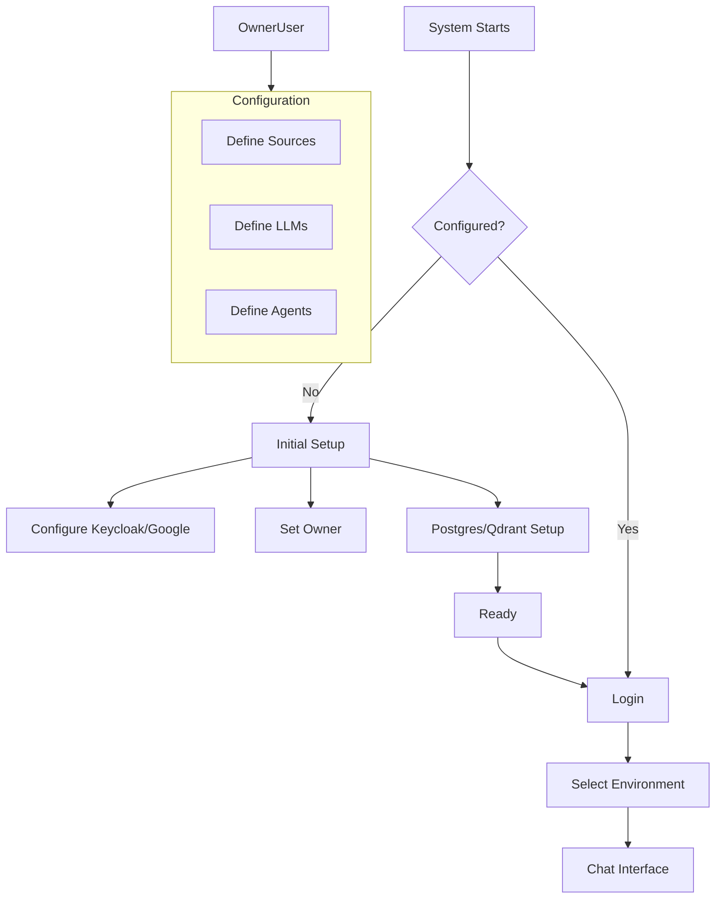

# Guide 001: Walkthrough

## Application Flow

This document describes the workflow for the **AI Data Lake System (Tools IADATA)**, based on the initial design sketches.

### 1. Initial Configuration (First Run / New Install / New Deployment / Non-Valid Configuration)

> **Developer Inquiry**: This must run previous to composing the docker-compose stack, because some of the settings will be written to the `.env` file. What's the best strategy to handle this in a professional and reliable way?

When the system starts for the first time, it enters a configuration mode.

> **Developer Inquiry**: How does the system know if it has been configured before and if the configuration is valid?

1.  **System Config Check**: The system checks if it has been verified.
**Developer Inquiry**: If the configuration is valid and verified, the system will skip this configuration alltogether and proceed to composing the docker-compose stack. 

2.  **Keycloak Integration**:
    - **Set Google Credentials**: Configure Google OAuth Client ID/Secret in Keycloak.
    - **Set Owner**: Define the initial Admin/Owner user.

3.  **Database Setup**:
    - **Postgres Credentials**: Setup `pg-dl` access.
    - **Grant Access**: Ensure backend has permissions.

When the configuration is verified, the system will proceed to composing the docker-compose stack.

> **Developer Inquiry**: But should there be an option down the road to return to the configuration and change it?  What's the correct procedure? A method to overwrite the settings in the `.env` file and then prompting the user to restart the system so that the "Initial Configuration" process (pre-compose) is applies the given changes? Analyze the proper approach.

> **Note**: This is largely handled by the `docker-compose` stack and `.env` variables in this deployment version once the process reaches the docker-compose stage.

### 2. Environment Definition
Once configured, the Owner/Admin defines the working "Environments". The environment is a collection of settings that encapsulate the behavior of the system on a given session. The user can set different environments to define different behaviors for different sessions. A given environment can have different LLMs defined, different data sources, different agents, etc.

> **Developer Inquiry**: First the user defines a name and description for the Environment. Then the user can define the LLMs, data sources, agents, etc. for the environment, as follows:

#### A. Sources Definition
Define where data comes from:
- **Local host directory**: Path mapping to local files. 
- **Network location**: Intranet location the host machine is part of.
- **Google Drive**: Using Google Drive API.
- **Web Sources**: URLs or Search APIs (e.g., Perplexity).
- **Sharepoint**: Using Sharepoint API.
- **Note**: determine if there may be other popular sources that should be added.

> **Developer Inquiry**: What is the best approach for the user to be able to define and verify/validate the sources? There should be a verification process to ensure the sources are accessible and valid.

> **Developer Inquiry**: Consider that for local host directory access, the application is running in a container, so the user should be able to define a path to a directory on the host machine that the container can access. This should be included in the configuration process before composing the docker-compose stack. And proper directions should be evident to the user when setting up his local host directory access.

#### B. LLM Definition
Configure available models:
- **Service-based**: Gemini (Flash, 3 Pro), GPT (4.1 mini, 5.2).
- **Local**: Local LLM endpoints (Dolphin X1 8B, BAAI/bge-m3). **Note**: The local model is only for embedding/tokenization/ingestion purposes, not for chat. This is actually required if the environment is gonna require tokenization/embedding/ingestion into Qdrant.
- **Default Model**: Select one "chat" model as the system default.  The user can switch models during chat session.

#### C. Agents
Create specialized agents:
- **Agent A1, A2, A3**: e.g., "Research Agent", "Coding Agent", "Conversation Agent", "Summarization Agent", etc.
- **Agent Prompt**: As part of the specs, this defines the system prompt for each agent.  Assisted by the default LLM Model.
- **Specs**: Define specific LLM, System Prompt, and Tools for each agent.
> **Developer Inquiry**: User can set the environment to use tokenization/embedding/ingestion (Qdrant) or not. If not, are there still tokenization/embedding/ingestion processes require to query the data sources? If yes, then, it should use a different model, so, an additional default should be set for embedding purposes, or still use the local model if available.

### 3. Usage Flow (User)
1.  **Select Environment**: User picks which configured environment context to work in.
2.  **Select Agent**: (Optional) User selects a specific agent or lets the system route.
3.  **Chat Interface**:
    - User interacts via the Next.js `front-dl` interface.
    - System retrieves data from `ia-dl` (Qdrant) OR direct parsing using the "embedding" default model or the local model.
    > **Developer Inquiry**: The system should be able to handle the case where the user has not configured Qdrant, but still requires tokenization/embedding/ingestion?. In this case, the system should use the "embedding" default model or the local model to parse the data sources. In each scenario, how is data gathered and sent to the final response processing LLM?  Detail any additional step(s) here.
    - Agents process queries using configured LLMs.
    - Responses are streamed back.

### 4. Roles
- **Owner**: Full access, system configuration, environment creation.
- **Admin**: Share environments, invite collaborators, tweak settings.
- **Standard**: Chat usage only.
>> **Developer Inquiry**: are the Roles above available/configurable in KeyCloak user management system?  What other roles should be added?

## Mermaid Flowcharts

> **Developer Inquiry**: Analyze the flowcharts below and provide any additional information or clarification needed. Create a Chart that focus on the pre-compose/configuration process, and another chart that focus on the post-compose/configuration process.

