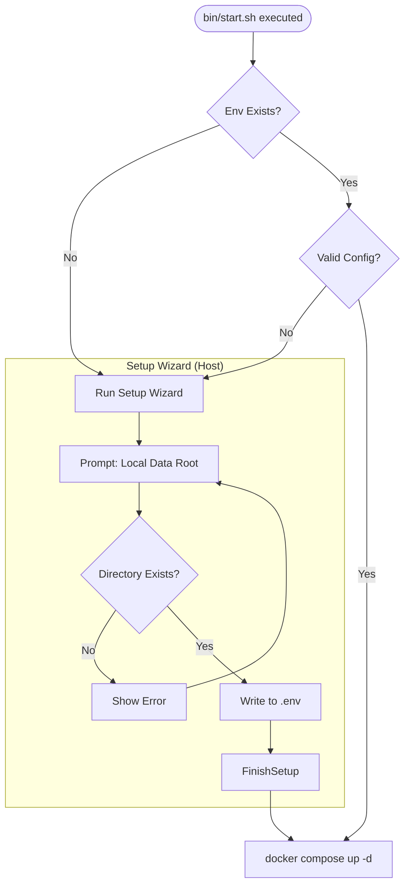
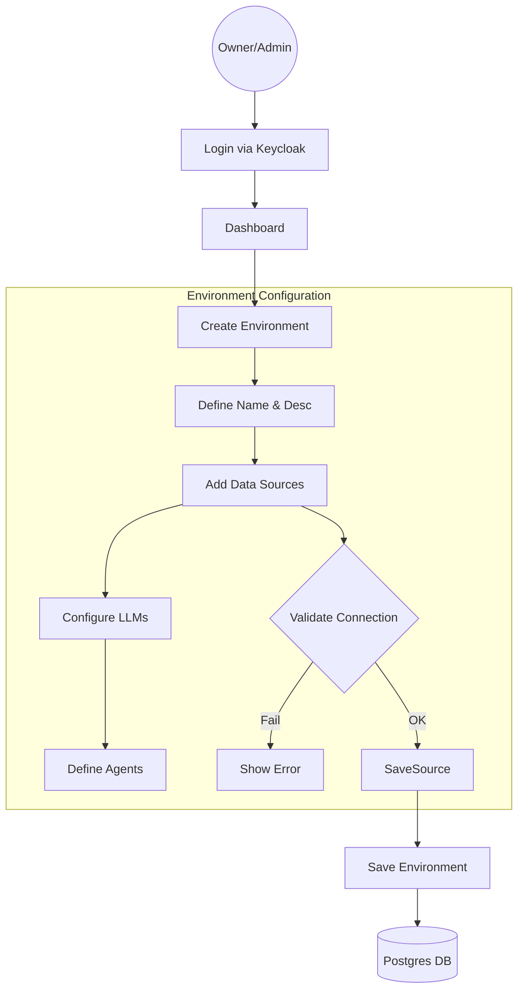
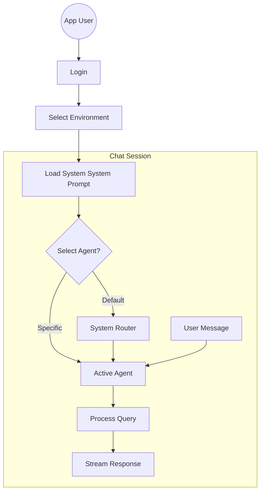
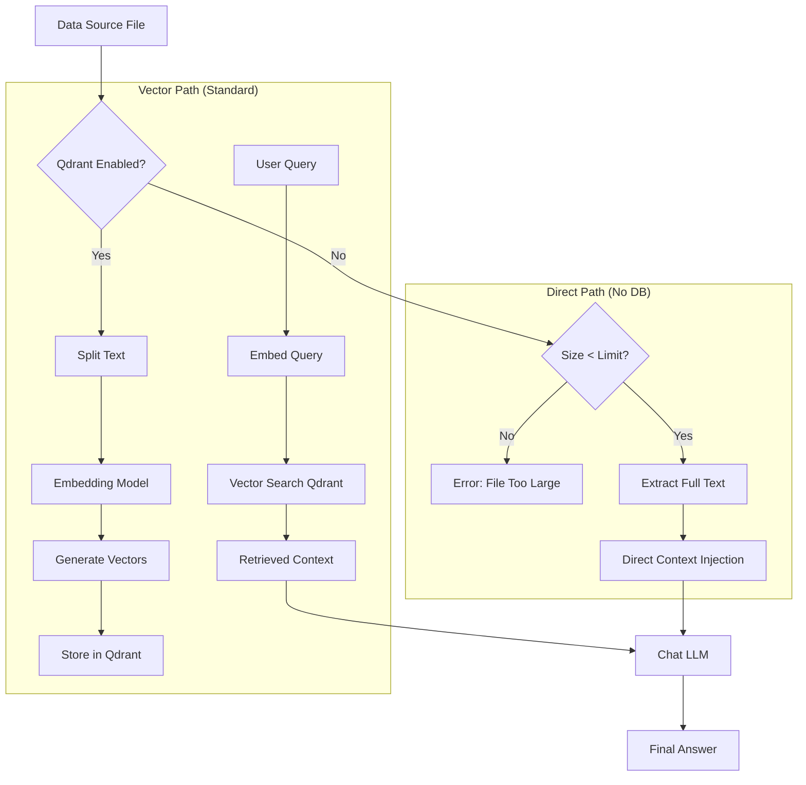

# Guide 002: Walkthrough (Architecture & Workflow)

## Overview
This document serves as the Version 2.0 Architectural Lifecycle Guide for the **AI Data Lake System (Tools IADATA)**. It resolves initial developer inquiries and establishes the standard for installation, configuration, and operation.

## Phase 1: Pre-Composition (Host-Side) Configuration

> **Architectural Decision**: To handle host-path mapping and environment variable injection *before* containers start, we use a "Pre-flight" script. This is critical because Docker Compose volume mappings cannot be dynamically altered after startup without a restart.

### 1.1 The "Pre-flight" Handshake
Before `docker compose up` is executed, the `bin/start.sh` script acts as the "Pre-flight Wizard".

1.  **Configuration Presence Check**:
    - Script checks for `.env`.
    - Script checks for specific sentinel values (e.g., `SETUP_COMPLETED=true` or `LOCAL_DATA_ROOT` variable).
    - **Resolution**: If valid configuration exists, the script **skips** to Phase 2 (Docker Composition).

2.  **Initial Setup Wizard (CLI)**:
    - If configuration is missing, the script interacts with the user on the Host Terminal:
        - **Host Data Root**: Prompts user for a directory path on the HOST to serve as the root for local files (e.g., `/home/user/my_datalake`).
        - **Validation**: Scripts checks `[ -d "$INPUT_DIR" ]`.
        - **Writing**: Writes `LOCAL_DATA_ROOT=/home/user/my_datalake` to `.env`.
    - **Reconfiguration**: Run `bin/start.sh --configure` to overwrite these settings.

### 1.2 Mermaid Flow: Pre-Composition

## Phase 2: Post-Composition (Application) Configuration

### 2.1 System Initialization
Once containers are up, `front-dl` (Next.js) becomes the primary interface.

1.  **Dependency Check**: Backend checks connectivity to Keycloak, Postgres, and Qdrant.
2.  **Keycloak Bootstrap**:
    - **Roles**: System ensures Keycloak has the following Realm Roles:
        - `app-owner`: Can manage system settings and create environments.
        - `app-admin`: Can manage users and share environments.
        - `app-user`: Can use chat interfaces.
    - **Resolution**: Keycloak is the Single Source of Truth for identity. The Backend maps these JWT roles to internal permissions.

### 2.2 Environment Definition (The Core Entity)
An **Environment** is a database entity (stored in Postgres) that encapsulates a workspace.

#### Hierarchy & Component Order
The system follows a strict hierarchical order for defining an environment's capabilities:
1.  **Identity & Access**: Who can access this environment (Roles).
2.  **Resources (Input)**:
    - **Data Sources**: Static or streaming data (Files, Drive).
    - **MCP Servers**: Dynamic context providers (Model Context Protocol).
3.  **Intelligence (Processing)**:
    - **LLM Configuration**: The brains (Chat & Logic models).
    - **Vector Store**: The long-term memory (Qdrant Collections).
4.  **Agents (Execution)**:
    - **Personas**: Specialized system prompts using the above resources.

---

#### A. MCP (Model Context Protocol) Integration
MCPs are treated as **Dynamic Data Providers** that can expose both *Resources* (read-only context) and *Tools* (executable actions).

- **Definition**: Users define MCP Servers (Standard IO or SSE) within an Environment.
- **Connection**: The Backend acts as the MCP Client, bridging the Agent to the MCP Server.
- **Scope**:
    - **Global MCPs**: Available system-wide (e.g., specific internal APIs).
    - **Env-Scoped MCPs**: Specific to the environment (e.g., a "GitHub MCP" configured for a specific repo).
- **Security**: MCP definitions include environment variables (API keys) stored encrypted.

#### B. Sources Definition
Sources are defined within an Environment.
- **Local Host Directory**:
    - **Architecture**: The container mounts the HOST's `LOCAL_DATA_ROOT` (from Phase 1) to `/mnt/host_data` (Internal).
...
    - **User Action**: User browses subfolders of `/mnt/host_data` via the UI.
    - **Validation**: Backend verifies read access to the specific subfolder.
- **Network Location**: Mounted similarly or via SMB/NFS within the container.
- **Cloud APIs**: Google Drive / SharePoint.
    - **Auth**: User provides OAuth tokens or Service Account Keys via the UI.
    - **Validation**: Backend calls files.list API to dry-run connectivity.

#### B. LLM & Embedding Strategy (Resolution)
To handle the "No Qdrant" or "Hybrid" scenarios:

1.  **Chat Models**: Used for reasoning (GPT-4, Gemini).
2.  **Embedding Models**: Used for vectorization (Local `BAAI/bge-m3` or OpenAI `text-embedding-3-small`).
3.  **Ingestion Pipeline**:
    - **With Qdrant (Standard)**:
        `Source -> Chunking -> Embedding Model -> Vector -> Qdrant (Indices)`
    - **Without Qdrant (Direct Parsing)**:
        `Source -> Text Extraction -> Context Window Injection -> Chat Model`

### 2.3 Flowchart: Configuration (Application Level)

### 2.4 Flowchart: Application (User Flow)

### 2.5 Flowchart: Qdrant vs Direct Query

## Phase 3: Usage & Roles

### 3.1 Role Capabilities
| Role | Phase 1 (Host) | Phase 2 (Config) | Phase 3 (Chat) |
| :--- | :--- | :--- | :--- |
| **SysAdmin** | Runs `setup.sh`, defines `DATA_ROOT` | N/A | N/A |
| **App Owner** | N/A | Creates Environments, Connects Clouds | Full Chat Access |
| **App Admin** | N/A | Invites Users, Assigns Roles | Full Chat Access |
| **App User** | N/A | Selects shared Environment | Chat only |

### 3.2 Handling "No Qdrant"
If a user selects an Environment with "Direct Parsing" (No Qdrant):
1.  **Constraints**: The UI strictly limits file size selection (e.g., < 10MB total) to prevent Context Window overflow.
2.  **Process**:
    - Backend reads file content into RAM.
    - Backend truncates content to fit LLM Context Window (e.g., 128k tokens).
    - Backend injects strict system prompt: "Answer based ONLY on the following context...".
